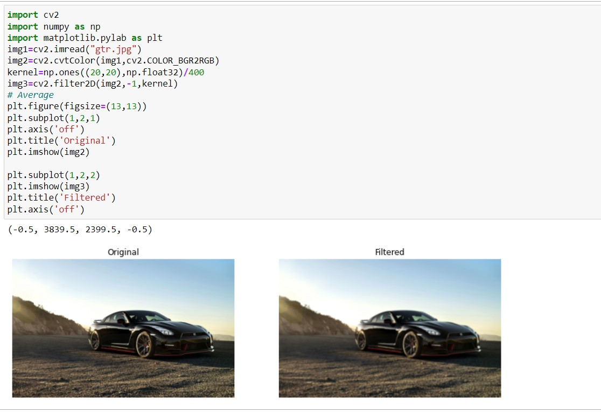
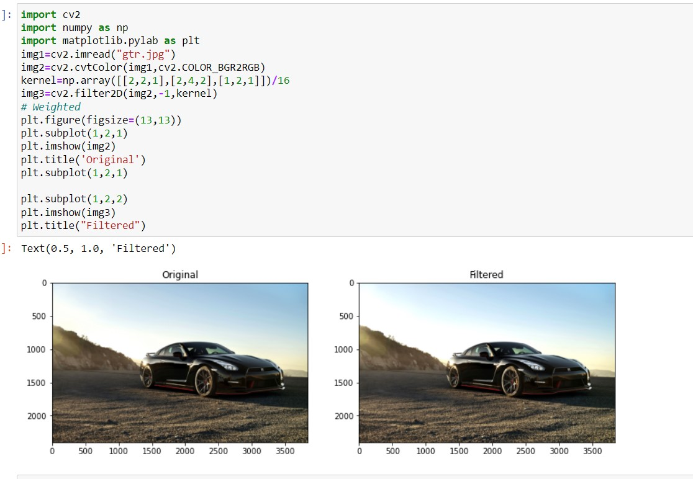
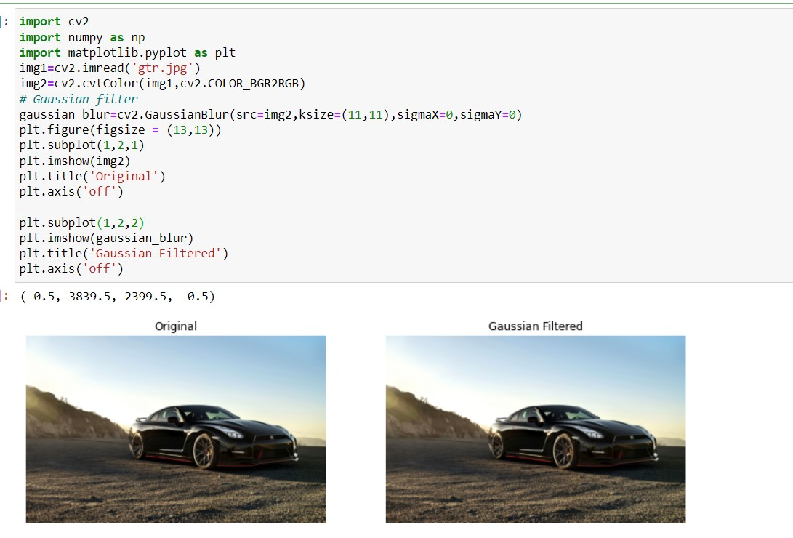
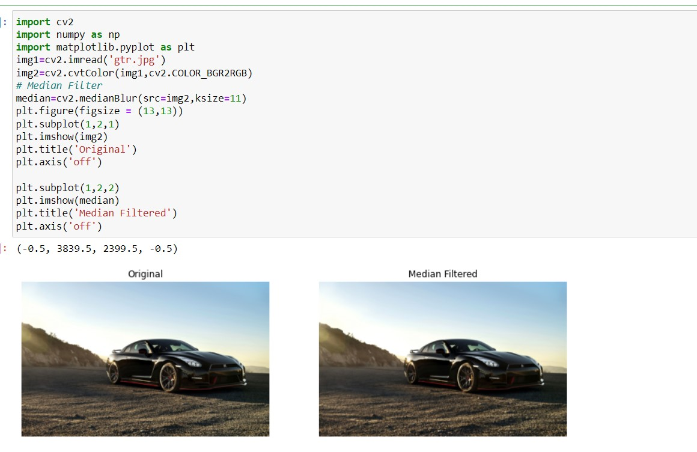
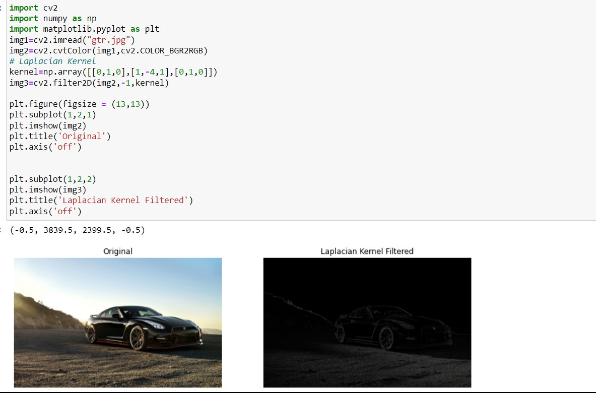
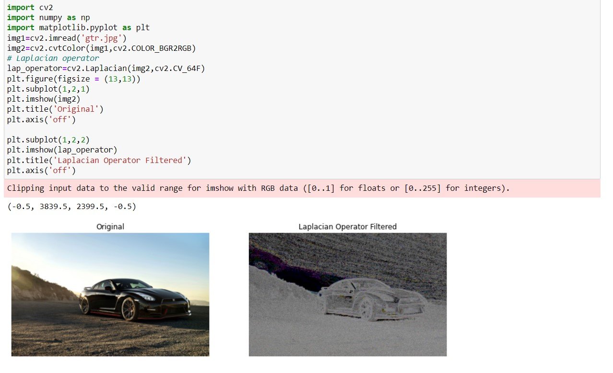

# Implementation-of-Filters
# Aim:
To implement filters for smoothing and sharpening the images in the spatial domain.

# Software Required:
Anaconda - Python 3.7

# Algorithm:
### Step1:
Import necessary packages numpy,cv2 and matplotlib and save the image to perform Image filtering.

### Step2:
Use the syntax cv2.filter2D() to perform filtering.

### Step3:
For Average filter use the syntax = kernel=np.ones((9,9),np.float32)/81 .

### Step4:
For Weighted average filter use the syntax = kernel=np.array([[1,2,1],[2,4,2],[1,2,1]])/16 .

### Step5:
For Gaussian filter use the syntax = gaussian_blur=cv2.GaussianBlur(src=image2,ksize=(11,11),sigmaX=0,sigmaY=0).

### Step6:
For Median filter use the syntax = median=cv2.medianBlur(src=image2,ksize=11).

### Step7:
For Laplacian kernel filter use the syntax = kernel=np.array([[0,1,0],[1,-4,1],[0,1,0]]).

### Step8:
For Laplacian operator use the syntax = lap_operator=cv2.Laplacian(image2,cv2.CV_64F).

### Step9:
Run the program by using the syntax , and print the output.

# Program:
### Developed By   : Mothesh M
### Register Number: 212221230066
</br>

### 1. Smoothing Filters

i) Using Averaging Filter
```Python
import cv2
import numpy as np
import matplotlib.pylab as plt
img1=cv2.imread("gtr.jpg")
img2=cv2.cvtColor(img1,cv2.COLOR_BGR2RGB)
kernel=np.ones((20,20),np.float32)/400
img3=cv2.filter2D(img2,-1,kernel)
# Average 
plt.figure(figsize=(13,13))
plt.subplot(1,2,1)
plt.axis('off')
plt.title('Original')
plt.imshow(img2)
plt.subplot(1,2,2)
plt.imshow(img3)
plt.title('Filtered')
plt.axis('off')

```
ii) Using Weighted Averaging Filter
```Python
import cv2
import numpy as np
import matplotlib.pylab as plt
img1=cv2.imread("gtr.jpg")
img2=cv2.cvtColor(img1,cv2.COLOR_BGR2RGB)
kernel=np.array([[2,2,1],[2,4,2],[1,2,1]])/16
img3=cv2.filter2D(img2,-1,kernel)
# Weighted
plt.figure(figsize=(13,13))
plt.subplot(1,2,1)
plt.imshow(img2)
plt.title('Original')
plt.subplot(1,2,1)
plt.subplot(1,2,2)
plt.imshow(img3)
plt.title("Filtered")

```
iii) Using Gaussian Filter
```Python
import cv2
import numpy as np
import matplotlib.pyplot as plt
img1=cv2.imread('gtr.jpg')
img2=cv2.cvtColor(img1,cv2.COLOR_BGR2RGB)
# Gaussian filter
gaussian_blur=cv2.GaussianBlur(src=img2,ksize=(11,11),sigmaX=0,sigmaY=0)
plt.figure(figsize = (13,13))
plt.subplot(1,2,1)
plt.imshow(img2)
plt.title('Original')
plt.axis('off')
plt.subplot(1,2,2)
plt.imshow(gaussian_blur)
plt.title('Gaussian Filtered')
plt.axis('off')

```

iv) Using Median Filter
```Python
import cv2
import numpy as np
import matplotlib.pyplot as plt
img1=cv2.imread('gtr.jpg')
img2=cv2.cvtColor(img1,cv2.COLOR_BGR2RGB)
# Median Filter
median=cv2.medianBlur(src=img2,ksize=11)
plt.figure(figsize = (13,13))
plt.subplot(1,2,1)
plt.imshow(img2)
plt.title('Original')
plt.axis('off')
plt.subplot(1,2,2)
plt.imshow(median)
plt.title('Median Filtered')
plt.axis('off')

```

### 2. Sharpening Filters
i) Using Laplacian Kernal
```Python
import cv2
import numpy as np
import matplotlib.pyplot as plt
img1=cv2.imread("gtr.jpg")
img2=cv2.cvtColor(img1,cv2.COLOR_BGR2RGB)
# Laplacian Kernel
kernel=np.array([[0,1,0],[1,-4,1],[0,1,0]])
img3=cv2.filter2D(img2,-1,kernel)
plt.figure(figsize = (13,13))
plt.subplot(1,2,1)
plt.imshow(img2)
plt.title('Original')
plt.axis('off')
plt.subplot(1,2,2)
plt.imshow(img3)
plt.title('Laplacian Kernel Filtered')
plt.axis('off')

```
ii) Using Laplacian Operator
```Python
import cv2
import numpy as np
import matplotlib.pyplot as plt
img1=cv2.imread('gtr.jpg')
img2=cv2.cvtColor(img1,cv2.COLOR_BGR2RGB)
# Laplacian operator
lap_operator=cv2.Laplacian(img2,cv2.CV_64F)
plt.figure(figsize = (13,13))
plt.subplot(1,2,1)
plt.imshow(img2)
plt.title('Original')
plt.axis('off')
plt.subplot(1,2,2)
plt.imshow(lap_operator)
plt.title('Laplacian Operator Filtered')
plt.axis('off')

```

## OUTPUT:
### 1. Smoothing Filters
</br>

i) Using Averaging Filter


ii) Using Weighted Averaging Filter

iii) Using Weighted Averaging Filter

iv) Using Median Filter

### 2. Sharpening Filters
</br>

i) Using Laplacian Kernal

ii) Using Laplacian Operator

# Result:
Thus the filters are designed for smoothing and sharpening the images in the spatial domain.
